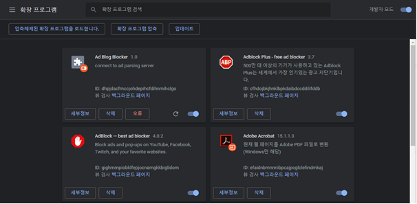
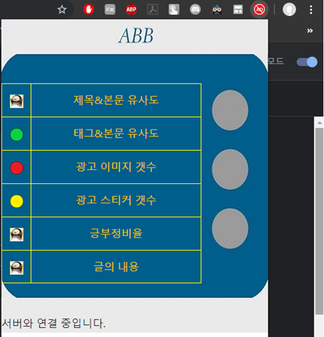
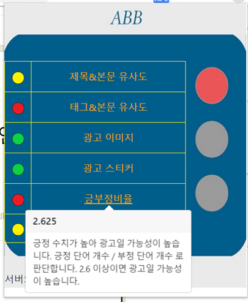

# Capston Design

## Ad Blog Blocker Chrome Extension 

<네이버 블로그 광고성 판별 크롬 확장프로그램>

### Introduction
Blog is originally for doing memo about personal thoughts or information and sharing them with others. There are blogs which are handled by the film such as ‘Naver’. Because it is related to its searching portal, there is a clear advantage that the blogs can be disposed from web users easily. However, there are the users who abuse this advantage. With paid fee from advertisement film, the users advertise the information about certain products. The problem is that the information is not honest reviews but intended stories for personal profit from advertisers. There is no difference between reading blogs and advertisement sites.

### Product
The goal of our team is implementing the program which can output the certain percentage of likeliness if the content of blog is an advertisement or not. 
In ideal, it will be the best if the program will determine that it is an advertisement or not. However, the unperfect classification can block useful content from user too. So, the product will show the percentage of advertisement-likeness. For practical use, the program will be implemented as the Chrome extension or something other one for easy accessibility for user.

### Idea of Algorithms
There are several ways to recognize that it’s an advertisement or not. 
1. The First one is catching key points from the data of blogs with web scraping. For example, there is a famous blog-advertising film ‘Weble’. And the blogs, which is influenced by Weble, remain some hints such as the fixed images brought from Weble like “This content is supported from Weble”.
2. The second one is making ‘advertisement words dictionary’ and use it on filtering the blog. The ‘advertisement words dictionary’ is a collection of words which are usually written on advertising blogs. The advantage of this algorithm from the user’s view is that it will be an integrated filtering system. Unlike the message filtering system (Naver) on ‘Similar Programs’ part, the users don’t need to search and update advertisement-like word list.
3. The third one, which is challenging and reinforced or discarded after experiments, is assuming that there are certain and unique patterns of positive/negative words. Because advertisement is appealing only good aspects of products in limited resources. So, there will be experiments if there are the patterns only found from advertisement blogs. The link below is already implemented positive/negative words dictionary. And this will be adjusted and reinforced for this project. 

The link about [positive/negative words](http://web.yonsei.ac.kr/dslab/Journal/sentiment%20dictionary.pdf)

### How to use
1. Download the zip file from the link above.
2. Extract the file and open the Chrome.
3. Go to chrome://extensions/ and turn the ‘developer mode’ on.
4. Load the ‘ChromeExtension’ folder from the downloaded file. (The folder where ‘manifest.json’ included)
5. After this process, ABB will be on the browser.

6. Turn on ‘Ad Blog Blocker’ and go inside naver blog.
7. Click the red ‘AD’ button and UI window will be opened.

When Error occured

Success

8. The server isn’t turned on now, so it won’t work in real world.

### Roll of Each Members
SeungYun Yeom 
- Implementing Naver blog parsing module
- Structing Dataset for Algorithm
- Implementing Algorithm
- Chrome extension Design and Implementing

JaeHyungJung
- Data collecting
- Implementing Algorithm

JiHyuk Choi
- Chrome extension Design and Implementing
- Implementing Algorithm
